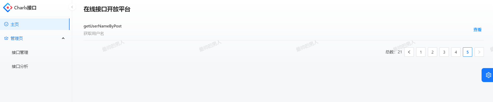
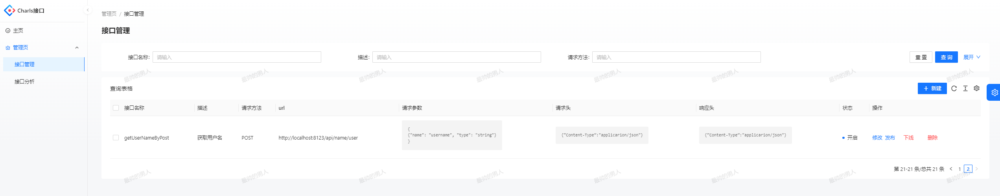
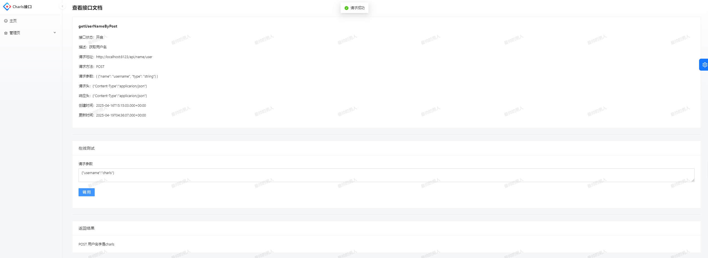
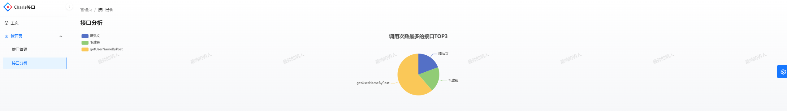
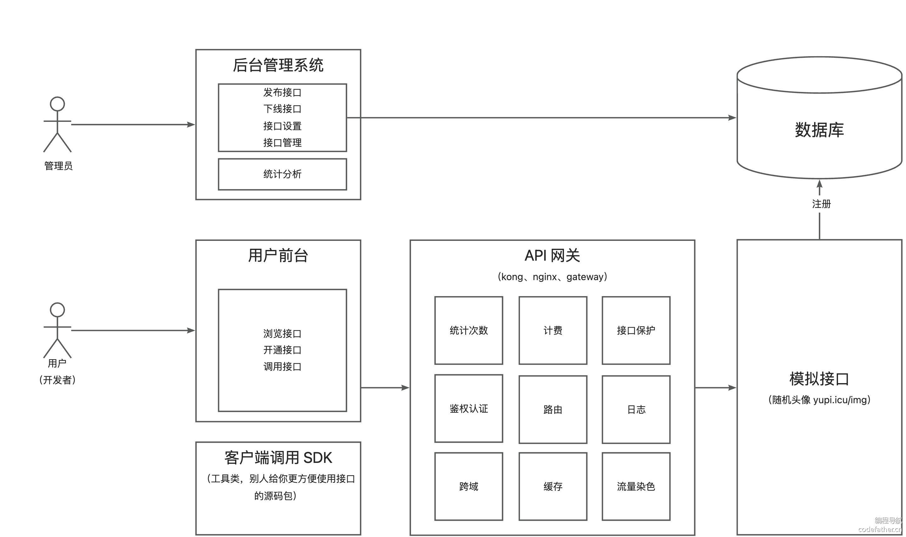

#  API开放平台

##  项目介绍

本项目是一个面向开发者的 API 平台，提供 API 接口供开发者调用。用户通过注册登录，可以开通接口调用权限，并可以浏览和调用接口。每次调用都会进行统计，用户可以根据统计数据进行分析和优化。管理员可以发布接口、下线接口、接入接口，并可视化接口的调用情况和数据。


主页（浏览接口）：



接口管理：



在线调试：



接口分析：




## 架构图




## 需求分析

背景：

1. 前端开发需要用到后台接口
2. 使用现成的系统的功能（http://api.btstu.cn/）

做一个 API 接口平台：

1. 管理员可以对接口信息进行增删改查
2. 用户可以访问前台，查看接口信息

其他要求：

1. 防止攻击（安全性）
2. 不能随便调用（限制、开通）
3. **统计调用次数**
4. 计费
5. 流量保护
6. API 接入


## 技术栈

**前端：**

- React 18
- Ant Design Pro 5.x 脚手架
- Ant Design & Procomponents 组件库
- Umi 4 前端框架
- OpenAPI 前端代码生成

**后端：**

- Spring Boot
- MySQL 数据库
- MyBatis-Plus 及 MyBatis X 自动生成
- **API 签名认证（Http 调用）**
- **Spring Boot Starter（SDK 开发）**
- **Dubbo 分布式（RPC、Nacos）**
- Swagger + Knife4j 接口文档生成
- **Spring Cloud Gateway 微服务网关**
- Hutool、Apache Common Utils、Gson 等工具库


#  本地部署

##  后端部署

1. 修改`application.yml`配置文件

   ```yml
   spring:
     # 数据库配置
     # todo 需替换配置
     datasource:
       driver-class-name: com.mysql.cj.jdbc.Driver
       url: jdbc:mysql://localhost:3306/xu_api
       username: root
       password: root
     # Redis 配置
     # todo 需替换配置
     redis:
       database: 0
       host: localhost
       port: 6379
       timeout: 5000
   
   # SDK 配置
   xuapi:
     client:
       access-key: charls
       secret-key: abcdefgh
   
   # 以下配置指定了应用的名称、使用的协议（Dubbo）、注册中心的类型（Nacos）和地址
   dubbo:
     application:
       # 设置应用的名称
       name: dubbo-springboot-demo-provider
     # 指定使用 Dubbo 协议，且端口设置为 -1，表示随机分配可用端口
     protocol:
       name: dubbo
       port: 22221
     registry:
       # 配置注册中心为 Nacos，使用的地址是 nacos://localhost:8848
       id: nacos-registry
       address: nacos://localhost:8848
   ```

2. install这两个`xuapi-client-sdk`、`xuapi-common`，并刷新依赖

   - 安装步骤：maven -》 Lifecycle -》 install

3. 启动Redis服务器

4. 安装nacos 2.4.3版本 ，单机启动Nacos `startup.cmd -m standalone`。

5. 创建数据库，执行`ddl.sql`

6. 启动`MyAllication`、`XuapiGatewayApplication`、`XuapiInterfaceApplication`

7. 运行主类

8. 访问接口文档：http://localhost:7529/api/doc.html    ——可以通过这里创建用户


##  前端部署

1. 项目打开执行`npm isntall`
2. 执行`package.json`文件中命令`"dev": "npm run start:dev"`
3. 访问：http://localhost:8000/       
